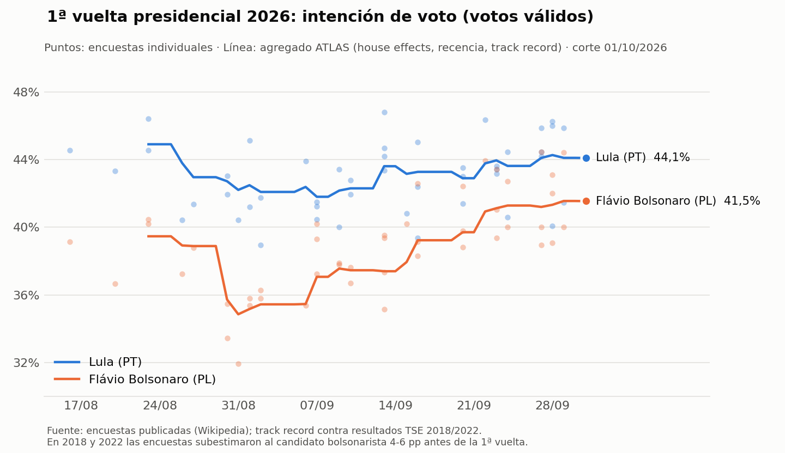

# Brief ATLAS Brasil 2026 — previo a la 1ª vuelta

**Fecha de corte:** 1/10/2026 (encuestas con campo hasta el 29/9) · **Elección:** 4/10 · **Balotajes:** 25/10

## Mensajes clave

1. **La presidencial va a 2ª vuelta entre Lula y Flávio Bolsonaro.** La
   probabilidad de balotaje es del 94%, y en casi todas las simulaciones el par
   es Lula–Flávio. En votos válidos, Lula tiene 44,1% y Flávio 41,6%. Ningún
   tercero llega al 5%.
2. **El balotaje está abierto, con ventaja de Flávio.** Las encuestas de cruce
   dan Lula 49,5% contra Flávio 50,5%. La probabilidad de ser presidente es
   **Flávio 54% · Lula 46%**.
3. **El riesgo está de un solo lado.** En 2018 y 2022, las encuestas previas a
   la 1ª vuelta subestimaron al candidato bolsonarista en 4 a 6 pp, en las 4
   mediciones. Si se repite, Flávio pasa a **86%**. No lo corregimos de oficio
   porque son solo dos elecciones, pero es la principal fuente de error del
   número.
4. **La tendencia favorece a Flávio.** La brecha de 1ª vuelta bajó de ~6 pp a
   mediados de septiembre a 2,6 pp hoy.
5. **Gobernadores:** el Centrão es favorito en 19 de las 27 UF (rango 16–22).
   Se esperan ~6 balotajes estaduales el 25/10. Este modelo **no usa
   encuestas**: es estructural, sobre la base 2022.
6. **Congreso:** el Centrão sigue siendo el bloque pivote. Tiene ~240
   diputados (205–277, sin mayoría propia de 257) y ~35 senadores (32–39). La
   probabilidad de que llegue a 41 senadores es del 5%. También son modelos sin
   encuestas.

---

## 1. Presidencial

| | Estimación principal | Si se repite el sesgo de 2018/2022 |
|---|---|---|
| Lula, 1ª vuelta (válidos) | 44,1% (p10–p90: 39,6–48,5) | — |
| Flávio, 1ª vuelta (válidos) | 41,6% (37,2–46,0) | — |
| Santos · Cury · Caiado · Zema | 4,3 · 4,2 · 3,6 · 1,4 | — |
| P(hay 2ª vuelta) | 94% | 80% |
| P(Lula gana en 1ª vuelta) | 5% | 5% |
| P(Flávio gana en 1ª vuelta) | 1% | 15% |
| Cruce Lula vs Flávio (% Lula) | 49,5% (42,6–56,2) | 44,3% (37,5–51,1) |
| **P(presidente)** | **Flávio 54% · Lula 46%** | **Flávio 86% · Lula 14%** |

**Cómo leerlo**

- Son votos válidos: sin blancos, nulos ni indecisos, igual que el resultado
  oficial. Por eso los números son más altos que los "votos totales" que
  publica la prensa.
- El rango p10–p90 no es el margen de error muestral. Es el error que tuvo
  nuestro agregador en 2018 y 2022: unos 4,5 pp en 1ª vuelta y 5,3 pp en el
  cruce.
- En las simulaciones, si las encuestas fallan con Flávio en la 1ª vuelta,
  fallan igual en el cruce, como pasó en 2018 y 2022.
- Los cruces de 2ª vuelta se midieron antes de la 1ª. En 2018 y 2022 ese tipo
  de medición erró 4 a 6 pp. Después de la 1ª vuelta, las encuestas de
  balotaje acertaron (±2 pp). El número de balotaje se va a recalibrar desde
  el 5/10.

**Calidad del agregador (backtest):** sobre 2018 y 2022 erró 3,5 pp en
promedio, contra 3,9 pp de la encuesta individual promedio. Es mejor en 5 de 6
mediciones. Las encuestadoras con mejor historial son MDA, AtlasIntel, Futura y
Real Time Big Data; las de peor historial, PoderData y FSB. En 2026, los
desvíos propios de cada casa en 1ª vuelta son chicos (todos menores a
1,7 pp). Palver y AtlasIntel muestran a Flávio algo más alto; Real Time Big
Data, MDA y Quaest, algo más bajo.

## 2. Gobernadores (modelo estructural, sin encuestas)

27 elecciones independientes, cada una con su propio balotaje. El modelo parte
del voto por família en 2022, más una ventaja del incumbente calibrada con 2018
y 2022. Acierta la família ganadora en 35 de 54 elecciones de calibración,
contra 33 si siempre gana el incumbente y 26 si siempre gana la família más
fuerte.

**Carreras más abiertas** (favorito con menos del 62%):

| UF | Favorito (família) | P(gana) | Retador | P(gana) | P(balotaje) |
|---|---|---|---|---|---|
| SC | Jorginho Mello (bolsonarista, incumbente) | 53% | Ralf Zimmer / João Rodrigues | 29% | 38% |
| MA | Felipe Camarão (gob. Lula, incumbente) | 54% | Orleans Brandão / Eduardo Braide | 33% | 36% |
| PR | Sandro Alex (Centrão) | 57% | Requião Filho | 22% | 28% |
| RJ | Garotinho / Eduardo Paes (Centrão) | 57% | William Siri | 21% | 46% |
| RN | Centrão (Rodrigo / Allyson) | 60% | Cadu / Roberio Paulino (gob. Lula) | 25% | 46% |
| MG | Mateus Simões (Centrão, incumbente) | 62% | Kalil / Patrus | 18% | 45% |

Más probables de ir a balotaje: RO (49%), RN, RJ, MG (45–46%) y AM (40%).
SP: Tarcísio 76% contra Haddad 16%.

**Ojo:**
- Cuando una família tiene más de un candidato no incumbente, el modelo no los
  distingue: se muestran juntos ("Garotinho / Eduardo Paes").
- No incorpora encuestas estaduales. Es el siguiente módulo a construir.

## 3. Congreso (modelos estructurales, sin encuestas)

| Família | Câmara (513) — mediana (p10–p90) | Senado post-2026 (81) — mediana (p10–p90) |
|---|---|---|
| Centrão | 240 (205–277) | 35 (32–39) |
| Gobierno Lula | 127 (99–160) | 19 (15–23) |
| Direita bolsonarista | 90 (43–141) | 17 (13–22) |
| Centro liberal | 49 (24–80) | 7 (4–11) |

Ninguna família llega sola a la mayoría: 257 diputados o 41 senadores. El
Centrão alcanza los 41 senadores en solo el 5% de las simulaciones.

## 4. Qué mirar la noche del 4/10

- **Flávio por encima de ~44% de los válidos:** es la mitad del camino entre
  el agregado (41,6%) y el escenario corregido (~47%), y es la señal de que se
  repite el sesgo de 2018/2022. En ese caso, el escenario "con corrección" pasa a
  ser el principal.
- **Lula por encima de 50%:** probabilidad del 5%. Si pasa, no hay balotaje
  presidencial.
- **Votos de Santos, Cury y Caiado:** son los que se reparten en la 2ª vuelta.
- **SC, MA, RJ, RN y MG:** definen cuántos estados van a balotaje y si alguna
  família distinta del Centrão gana una UF grande.

## Metodología y trazabilidad

- **Presidencial:**
  - Explicación: `docs/agregacion_encuestas.md`.
  - Encuestas: Wikipedia revid 1377689808 (2026), 1368964934 (2022) y
    1365268056 (2018).
  - Corridas: `data/processed/electoral/encuestas_agregadas/2026-10-01T175046Z`
    y `presidencial_encuestas_sim/` del 1/10. Semilla 42, 10.000 simulaciones.
- **Gobernadores:** `docs/modelo_gobernadores.md`, corrida `gobernadores_sim/2026-10-01T150658Z`.
- **Câmara:** `docs/modelo_camara.md`. **Senado:** `docs/modelo_senado.md`.
- **Limitaciones comunes:**
  - Hay solo dos elecciones de historia (2018 y 2022) para medir el error.
  - Las encuestas vienen de una compilación pública, todavía no cruzada con el
    registro del TSE.
  - La presidencial es solo nacional.
  - Gobernadores y Congreso no usan encuestas.
